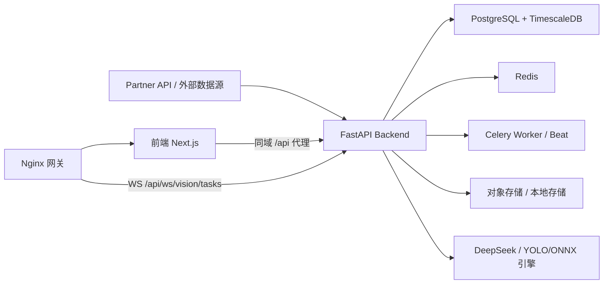

# 智慧农业管理系统

> 面向连栋玻璃温室的多角色协同管理平台：数据接入、可视化看板、视觉识别、AI 建议、专家审批、工人执行、调度与可观测性一体化。

- 许可：`PolyForm Noncommercial 1.0.0`
- 技术栈：`Next.js + FastAPI + PostgreSQL/TimescaleDB + Redis + Celery`
- 部署方式：`Docker Compose`

> 许可说明：本仓库为公开源码项目，默认仅允许非商用使用、学习、研究和内部评估，不允许未经授权的商业使用。

## 快速导航

- 项目计划：[`docs/project-plan.md`](docs/project-plan.md)
- 从 0 到 1 启动教程：[`docs/zero-to-one-setup-guide.md`](docs/zero-to-one-setup-guide.md)
- 生产上线清单：[`docs/production-go-live-checklist.md`](docs/production-go-live-checklist.md)
- 版本变更：[`CHANGELOG.md`](CHANGELOG.md)
- 商业授权：[`COMMERCIAL-LICENSE.md`](COMMERCIAL-LICENSE.md)

## 这是什么

这是一个围绕智能温室运营构建的管理系统参考实现。它不是单点页面演示，而是一条可以跑通的业务链路：

1. 接入真实或模拟温室数据。
2. 聚合成首页运营总览与趋势分析。
3. 通过 AI 智能解析形成可解释结论。
4. 把建议沉淀为待审批任务。
5. 由专家审批、工人执行并回填执行结果。
6. 用调度中心和可观测中心追踪整个系统运行状态。

## 这个项目解决什么问题

传统温室系统里，数据、分析、建议、执行、运维常常是割裂的。这个项目把它们收在一个后台里：

- 管理者：快速看到分区态势、风险、趋势和异常。
- 专家：基于真实数据和知识依据审批 AI 建议。
- 工人：按任务执行并提交结构化回填。
- 运维人员：统一查看调度、失败任务、慢接口和系统健康状态。

## 你可以直接体验的核心闭环

1. 首页总览：查看温室分区、环境指标、执行器状态和 24 小时趋势。
2. AI 智能解析：查看管理层摘要、专家层解析、证据引用和建议草稿。
3. 病害识别：上传图片，异步识别，实时看到任务状态变化。
4. 任务中心：完成 `PENDING -> APPROVED -> IN_PROGRESS -> COMPLETED` 全链路。
5. 调度与观测：查看定时任务、失败原因、慢请求与系统健康。

## 页面能力一览

| 页面 | 主要内容 | 典型使用者 |
|---|---|---|
| `数据总览 /dashboard` | 分区态势、核心指标卡、趋势图、异常与模块状态 | 管理者、专家 |
| `病害识别 /vision` | 图片上传、任务状态、识别结果、运行时状态 | 专家、运维 |
| `智能建议 /ai-insights/*` | AI 智能解析、建议草稿、本地知识库 | 管理者、专家 |
| `专家审批 /expert` | 待审任务、一键审批、可选指派工人 | 专家 |
| `工人执行 /worker` | 接单、开工、完工、结构化执行回填 | 工人 |
| `任务中心 /tasks` | 全量任务跟踪、状态筛选、来源筛选 | 管理者、专家 |
| `调度中心 /scheduler` | 任务运行、手动执行、暂停/恢复 | 超级管理员 |
| `可观测中心 /observability` | 慢接口、错误请求、失败任务排行 | 超级管理员 |

## 产品亮点

- 中文管理后台：按实际农业运营角色组织页面，而不是单纯技术演示页。
- 多源业务闭环：数据接入、AI 分析、视觉识别、任务执行在同一系统里打通。
- AI 可解释：不仅输出结论，还要求有数据证据与知识依据。
- 任务状态清晰：从 AI 建议到审批、执行、回填都有明确状态机。
- 运维可落地：Celery 调度、可观测 API、生产网关和部署脚本一并提供。

## 当前能力边界

- 公开仓库默认保留“可运行的参考实现”，不是客户私有定制版。
- 图片、GIF 与私有业务素材已从公开仓库移除，避免静态资源和隐私管理负担。
- AI 能力支持 DeepSeek 主链路，但也保留本地 LLM / 规则兜底，方便在无外网或无 Key 环境下联调。

## 适用场景

- 智能温室运营管理后台
- 温室环境与水肥时序数据治理
- 病害识别与 AI 辅助建议闭环
- 园艺、植保、环控、水肥任务协同执行
- 作为农业数字化项目的产品原型或平台底座

## 技术与业务能力总览

- 数据底座：PostgreSQL + TimescaleDB（含分层聚合与保留策略）
- 参数目录门禁：参数主数据目录 + 覆盖率门禁（100% 才通过）
- 业务看板：中文管理后台（Ant Design Pro 风格）
- 视觉链路：异步上传识别 + WebSocket 实时状态回传
- AI 智能解析：24h 双层解析、知识库联动、草稿确认入库（DeepSeek 主链路 + 本地 LLM 兜底 + 规则兜底）
- 任务闭环：`PENDING -> APPROVED -> IN_PROGRESS -> COMPLETED`
- 设置驱动自动任务：园艺/植保/环控/水肥四类策略自动触发任务
- 运维能力：Celery 统一调度、可观测 API 与管理页
- 生产部署：Docker Compose + Nginx 同域网关 + 外部 DB/Redis

## 技术栈

- 前端：Next.js 16, TypeScript, Ant Design Pro Components
- 后端：FastAPI, Celery, Redis
- 数据：PostgreSQL, TimescaleDB, Prisma
- AI：YOLOv8 + ONNX（`auto/yolo/onnx/mock`）, DeepSeek（可选）
- 部署：Docker, Nginx

## 系统架构



## 5 分钟体验路径

1. 启动本地环境后，先打开首页看分区态势和趋势图。
2. 进入 `智能建议 -> AI 智能解析`，看摘要、证据和建议草稿。
3. 进入 `病害识别` 上传一张测试图，确认异步任务状态会变化。
4. 进入 `专家审批` 审批一条任务。
5. 切换到 `工人执行` 完成接单、开工和完工回填。
6. 最后进入 `调度中心` 和 `可观测中心` 看系统后台运行情况。

## 目录结构

```text
.
├── frontend/                  # Next.js 前端
├── backend/                   # FastAPI 后端
├── scripts/                   # 启动/部署/验收脚本
├── docker/                    # Nginx / DB 初始化配置
├── docs/                      # 项目计划与操作文档
├── docker-compose.yml         # 本地中间件（db/redis）
└── docker-compose.prod.yml    # 生产拓扑（nginx+app，外部db/redis）
```

## 快速开始（本地开发）

### 1) 准备环境

- Node.js 20+
- Python 3.11+
- Docker Desktop

### 2) 准备环境变量

```bash
cp .env.example .env
cp frontend/.env.local.example frontend/.env.local
cp backend/.env.example backend/.env
```

### 3) 一键重启本地开发环境

```bash
bash scripts/ops.sh restart-dev
```

脚本会自动：
- 启动 `db/redis`
- 启动 backend / frontend
- 启动 celery worker / beat

### 4) 初始化数据库与账号（首次）

```bash
cd frontend
npm install
npm run prisma:migrate
npm run prisma:generate
npm run seed:auth
```

### 5) 访问系统

- 前端：`http://127.0.0.1:3000`
- 后端健康检查：`http://127.0.0.1:8000/health`

本地示例账号：
- `superadmin@example.local`
- `expert@example.local`
- `worker@example.local`

密码由你的本地 `.env` / `frontend/.env.local` 中 `SEED_*` 变量决定。公开模板默认只保留占位值，请在本地自行设置。

### 6) 真实数据 + AI 智能解析关键变量

```bash
# 建议真实联调时使用
HOOGENDOORN_PROVIDER=partner_api
HOOGENDOORN_SYSTEM_ID=REPLACE_WITH_SYSTEM_ID
HOOGENDOORN_METRIC_CATALOG_PATH=backend/data/hoogendoorn_metric_catalog.private.json

# DeepSeek 主链路
DEEPSEEK_API_KEY=REPLACE_WITH_DEEPSEEK_API_KEY

# 本地 LLM 兜底（可选）
LOCAL_LLM_ENABLED=false
LOCAL_LLM_BASE_URL=http://127.0.0.1:11434/v1
LOCAL_LLM_MODEL=qwen2.5:14b
```

## 生产部署

### 1) 准备生产变量

```bash
cp .env.prod.example .env
# 编辑 .env，替换域名/数据库/Redis/对象存储等真实参数
```

### 2) 部署前预检

```bash
bash scripts/ops.sh check-production-env
```

### 3) 一键部署

```bash
bash scripts/ops.sh deploy-production
```

### 4) 部署后验收

```bash
bash scripts/verify.sh production
```

验证项：
- 容器健康状态
- 网关 `/` 可达
- `/backend-health` 返回 200
- Vision WS 路径可达

## 常用脚本

| 脚本 | 用途 |
|---|---|
| `scripts/ops.sh restart-dev` | 本地前后端 + Celery + 中间件重启 |
| `scripts/ops.sh check-production-env` | 生产变量硬校验 |
| `scripts/ops.sh deploy-production` | 生产容器构建与启动 |
| `scripts/verify.sh production` | 生产部署后基础验收 |
| `scripts/verify.sh regression` | 全链路回归矩阵（研发回归） |
| `scripts/verify.sh` | 交互式验收菜单（中文编号选择） |

脚本结构（已统一归并）：
- `scripts/ops.sh`：运维总入口（开发重启、生产部署、策略脚本、知识采集）
- `scripts/verify.sh`：验收总入口（全量验收合集）
- `scripts/ops/*`：运维实现脚本
- `scripts/verify/*`：分阶段验收实现脚本

兼容说明：
- 验收入口已统一为 `scripts/verify.sh`（`verify_t*.sh` 已移除）。
- 过渡期仅保留运维类旧脚本兼容（会提示 `Deprecated` 并自动转发到新入口）。

## 文档导航

- 项目任务与进度：[`docs/project-plan.md`](docs/project-plan.md)
- 版本变更记录：[`CHANGELOG.md`](CHANGELOG.md)
- 首次公开发布说明：[`docs/releases/v0.1.0.md`](docs/releases/v0.1.0.md)
- 云端上线清单：[`docs/production-go-live-checklist.md`](docs/production-go-live-checklist.md)
- 从 0 到 1 启动与参数修改：[`docs/zero-to-one-setup-guide.md`](docs/zero-to-one-setup-guide.md)
- 贡献说明：[`CONTRIBUTING.md`](CONTRIBUTING.md)
- 社区行为准则：[`CODE_OF_CONDUCT.md`](CODE_OF_CONDUCT.md)
- 商业授权说明：[`COMMERCIAL-LICENSE.md`](COMMERCIAL-LICENSE.md)
- 私有资料处理说明：[`docs/private-materials.md`](docs/private-materials.md)
- 市场价值测算：[`docs/market-value-estimate.md`](docs/market-value-estimate.md)

## 安全与合规提示

- 不要把真实密钥提交到 Git 仓库。
- 不要把真实参数目录、客户系统 ID、合作方白皮书、账号导出文件提交到 Git 仓库。
- 生产环境必须启用对象存储，不建议写本地盘。
- 建议启用 HTTPS 与最小权限网络策略（仅开放网关端口）。
- 对外公开前建议执行：`bash scripts/verify.sh privacy`
- 如果私有文件曾经提交进 Git 历史，仅删除当前文件不够，必须先清理历史或导出一份全新的公开仓库。

## 关键接口（新增）

- 运维总览数据：
  - `GET /api/ops/catalog`（参数目录与覆盖率）
  - `GET /api/ops/live`（首页实时聚合）
  - `GET /api/ops/trends`（趋势与异常时间线基础数据）
- 智能解析：
  - `GET /api/ai-insights/summary`
  - `POST /api/ai-insights/recommendations`
  - `POST /api/ai-insights/recommendations/confirm`
- 设置驱动自动任务：
  - `GET /api/settings`
  - `GET /api/settings/{profile}`
  - `POST /api/settings/{profile}`
  - `POST /api/settings/{profile}/trigger`

## License

本项目采用 [PolyForm Noncommercial License 1.0.0](./LICENSE)。

对使用者的含义：

- 允许学习、研究、内部验证和其他非商用用途
- 不允许未经授权的商业使用、商业分发或面向商业场景的直接变现使用
- 需要保留许可证与 `NOTICE` 中的声明
- 如果你修改了项目，建议明确标注变更内容
- 仓库内第三方依赖仍需分别遵守其原始许可证

补充说明：

- 该许可证属于“源码公开 / source-available”范畴，不属于传统 OSI 定义下的开源许可证
- 如果你需要商用授权，请先阅读 [`COMMERCIAL-LICENSE.md`](./COMMERCIAL-LICENSE.md)
